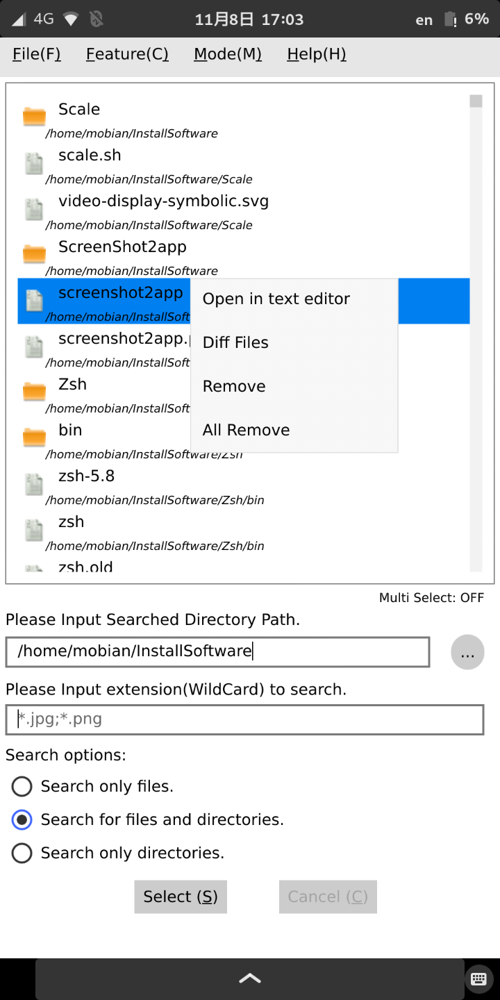

<<<<<<< Updated upstream
# GrepToolQML for PinePhone and Linux PC(x64_64)  

# Preface  
GrepToolQML is a scaling software for PinePhone and Linux PC(x86_64). 
 

=======
# GrepToolQML for PinePhone and Linux PC(x64_64)

# Preface  
>>>>>>> Stashed changes
GrepToolQML is a software to be able to search, edit, delete, and compare differences easily. 
 
This article uses Mobian(AArch64) and SUSE Linux Enterprise(x86_64). 
<u>you should be able to install it on other Linux distributions as well.</u> 
(Ex. Manjaro ARM, openSUSE TW, ... etc) 
 

*Note:* 
*GrepToolQML is created in Qt 5.15, so it requires Qt 5.15 library.* 
 
 

# 1. Install the necessary dependencies for GrepToolQML
Create a directory for installing Qt libraries on PinePhone. 
* libQt5Core.so.5
* libQt5Gui.so.5
* libQt5Widgets.so.5
* libQt5Concurrent.so.5
* libQt5Quick.so.5
* libQt5QuickControls2.so.5
* libQt5Qml.so.5
* libQt5QmlModels.so.5
* libQt5QuickTemplates2.so.5
* libQt5Network.so.5
 
 

Get the latest updates on PinePhone. 

    sudo apt update  
    sudo apt dist-upgrade  
 

Install the dependencies required to build the GrepToolQML.  

    sudo apt install qt5-qmake qt5-qmake-bin \
                     libqt5core5a libqt5widgets5 libqt5gui5 libqt5network5 libqt5concurrent5 \
                     libqt5qml5 libqt5qmlmodels5 libqt5quick5 libqt5quickcontrols2-5 libqt5quicktemplates2-5 libqt5qmlworkerscript5
 
 

# 2. Compile & Install GrepToolQML
Download the source code from GrepToolQML's Github. 

    git clone https://github.com/presire/GrepToolQML.git GrepToolQML

    cd GrepToolQML

    mkdir build && cd build
 

Use the qmake command to compile the source code of GrepToolQML. 
The default installation directory is <I>**${PWD}/GrepToolQML**</I>. 

The recommended installation directory is the home directory. (Ex. <I>**${HOME}/InstallSoftware/GrepToolQML**</I>)

    # for PC
    qmake ../GrepToolQML.pro PREFIX=<The directory you want to install in>

    # for PinePhone
    qmake ../GrepToolQML.pro MACHINE=pinephone PREFIX=<The directory you want to install in>

    make -j $(nproc)
    make install
 
    
    cp ../Applications/GrepToolQML.desktop  ~/.local/share/applications
 
 

# 3. Execute GrepToolQML
Make sure you can execute **GrepToolQML**. 
 

 
 

To search, first, press the round button to select the directory to search. 
Next, select the search option (radio button).
At that time, press the [Select] button.
And then, the list view at the top shows the files and directories searched.

 
 

To select multiple searched files or directories, double-tap an item. 
And then, the text and color display will change from "Multi Select: OFF" to "Multi Select: ON" at the bottom of the list. 

 
 

**PinePhone only** 
To set the editor and diff tools to be used, first, select [Feature] -> [Settings] at the Menu bar. 
Next, press the round button to select the executable for the editor and diff tool. 
Finally, click on the [Save] button. 

 
 

To set the color mode, select [Mode] -> [Dark Mode].
Next, press the switch to select Light (Universal Light) or Dark (Material Dark). 
After changing the color mode, press the [Application Quit] button. 
The software will be automatically restarted and the color mode setting will be reflected. 

 
 

You can open the context menu by long pressing on the searched files and directories.(**PinePhone only**) 
For PC version, the context menu can be displayed by right-clicking the mouse. 
 
<i>**Note:**</I> 
<i>**The editor can open a single file.**</I> 
<i>**Diff Tool can be used to diff 2 files.**</I> 

 

 
 
